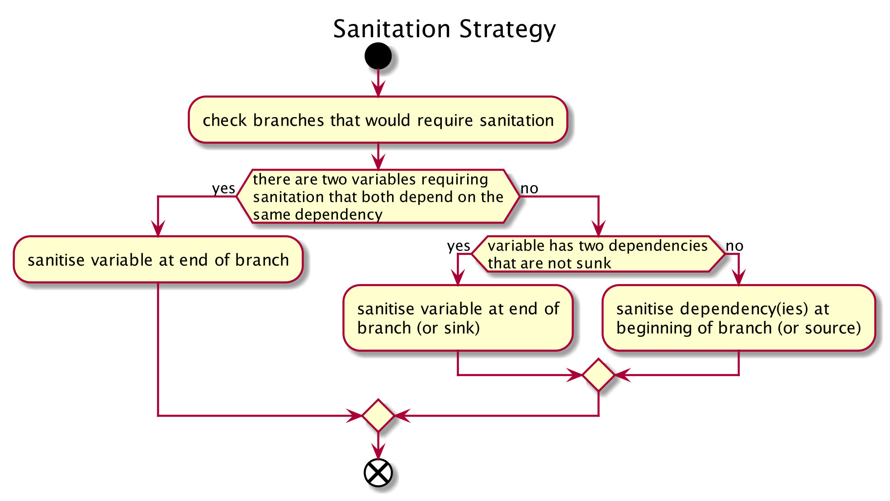

# pass_project
Program Analysis for System Security and Reliability project

## Usage
`taint_analysis.py` controls the execution. Its usage is the following:
```
usage: taint_analysis.py [-h] [-v | -q] [-d] {compile,run,test,clear} ...

Control program to launch all actions related to this project.

positional arguments:
  {compile,run,test,clear}
                        Commands
    compile             compile the datalog program
    run                 run the datalog program
    test                test the datalog program, do not provide additional
                        options before. Regular unittest options can be added
    clear               clear output, log, and binary files

optional arguments:
  -h, --help            show this help message and exit
  -v, --verbose         provide verbose output
  -q, --quiet           provide next to no output unless an error occured
  -d, --debug           provide debug information
```
Note that debug information is provided as a YAML logfile under `assets/logs/` and is not printed to console.

The `compile` command allows to compile the Datalog program into a binary executable for faster execution of larger inputs. Note that the compilation can take some time.

The `run` command takes one source file (or several) and analyses it. This will use a binary executable if present, otherwise it will run the Datalog program in an interpreter. Its precise usage is the following:
```
usage: taint_analysis.py run [-h] [-f] [-d DEST] source [source ...]

positional arguments:
  source                a list of any number of source files

optional arguments:
  -h, --help            show this help message and exit
  -f, --force           forces to use the interpreter even if a binary exists
  -d DEST, --dest DEST  a filename where to store the results
```

If the `-d` option is given, the results are printed to the given filename instead of the console. Moreover, note that verbosity options should be provided before the `run` command.

### Note
In order to run the interpreter or to compile the Datalog program, [`souffle`](https://github.com/oracle/souffle/wiki) should be in `PATH`. If a binary is already present, this is not necessary.

## Implementation
The functionalities of the application work as follows:

1. The input source file is parsed for Datalog tokens for the language defined [here](#predicates). Note that this is not a thorough parse at it will not look for errors in the input file but simply skip over invalid input.
2. The parsed tokens from step one are formatted as tab separated values in several `.facts` input files for the main Datalog program. These files can be found under `assets/datalog/` but should not be manually modified as this can result in errors in the main analysis.
3. The main Datalog analysis program is then called (either as a native binary or as the interpreter, depending on compilation) and analyses the input given in the `.facts` files based on the rules defined in the program (`assets/datalog/taint_analyser.dl`). The output of this is printed to output files in `assets/output`.
4. The output from step three is read by python in order to beautify the output. If a destination file is provided to `run`, this will be printed to the file instead of the console.

## Ideas
A decision tree to find the minimal sanitations:


